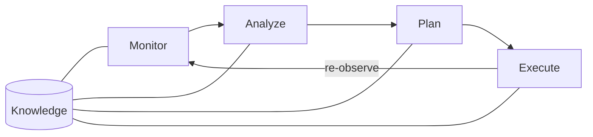

# Self-healing systems: what the literature says, and where Starfish sits

> **Status: a starting map, not a finished literature review.** Only four sources were read in
> full (marked below). Every other figure came from search summaries and must be checked
> against the original before it goes on a slide.

## TL;DR

Self-healing has been a feedback loop since 2001: sense, diagnose, act, re-check. What changed
over 25 years is what the loop is allowed to touch: first machines, then code, now code
written by LLM agents.

Five takeaways:

1. **Close the loop.** The value is in re-observing after acting, not in the action itself.
2. **Passing tests is not correctness.** Overfitting has been measured from GenProg (2015)
   to SWE-bench (2025).
3. **Cheapest safe action first.** SapFix tried a revert before any generated patch.
4. **Learn from your own history.** Getafix, RCACopilot and Google's AI Insights all mine
   past fixes or incidents.
5. **Autonomy is scoped by blast radius.** Every large deployment found here keeps a human
   gate on consequential changes.

## Origins: autonomic computing and MAPE-K

IBM's 2001 Autonomic Computing Manifesto named the problem: systems too complex for people to
run by hand. Its answer was systems that manage themselves: self-configuring, self-healing,
self-optimizing and self-protecting.

[Kephart & Chess, "The Vision of Autonomic Computing" (IEEE Computer, 2003)](https://dl.acm.org/doi/10.1109/MC.2003.1160055)
gave the loop its standard shape, MAPE-K:

Nearly every self-healing system since is a variant of this closed loop.

| Survey | Venue | What it adds |
| --- | --- | --- |
| Ghosh et al., "Self-healing systems: survey and synthesis" | Decision Support Systems, 2007 | First broad synthesis of the field |
| [Psaier & Dustdar, "A survey on self-healing systems"](https://link.springer.com/article/10.1007/s00607-010-0107-y) | Computing 91, 2011 | Detect, diagnose, recover; ties self-healing to autonomic principles |
| [Schneider et al., "A survey of self-healing systems frameworks"](https://onlinelibrary.wiley.com/doi/abs/10.1002/spe.2250) | Software: Practice and Experience, 2015 | Compares concrete frameworks |
| [Yazdanparast, "A Survey on Self-healing Software System"](https://arxiv.org/pdf/2403.00455) | arXiv, 2024 | Recent overview |

Garlan et al.'s Rainbow framework (CMU, early 2000s) added architecture-based adaptation:
keep a model of the running system, repair the model, then apply the change to the system.

## Generation 1: healing infrastructure, not code

The first loops in production restarted, replaced or rerouted things. None changed source
code, and a human wrote every remedy in advance.

| System | Year | What the loop does |
| --- | --- | --- |
| [Facebook FBAR](https://engineering.fb.com/2011/09/15/data-center-engineering/making-facebook-self-healing/) | 2011 | Daemons detect server faults, pull machines from production and file repair tickets; reported to do the work of about 200 sysadmins |
| [Kubernetes reconciliation loops](https://www.oreilly.com/library/view/97-things-every/9781492050896/ch73.html) (from Google's Borg) | 2014 | Controllers drive the actual state back to the declared state; a crashed pod is replaced |
| [Netflix Winston](https://medium.com/netflix-techblog/introducing-winston-event-driven-diagnostic-and-remediation-platform-46ce39aa81cc) (on StackStorm) | ~2017 | Event-driven runbooks act as tier-1 support: an alert fires and a scripted diagnosis or fix runs |

Why these work: every action is predefined, reversible and low blast radius. The loop never
has to decide *what* the fix is.

## Generation 2: automated program repair

Research then tried to close the loop at the code level. The central finding: a patch can
pass every test and still be wrong.

| Study | Year | Finding |
| --- | --- | --- |
| [Weimer, Le Goues et al., GenProg](https://roars.dev/pubs/le2011genprog.pdf) (ICSE 2009 / TSE 2012) | 2009 | First repair applied to real software: genetic programming mutates code until the failing tests pass |
| Qi et al., "An Analysis of Patch Plausibility and Correctness" (ISSTA) | 2015 | Of 55 bugs GenProg reported fixed, only 2 were fixed correctly; most "fixes" deleted functionality |
| [Smith et al., "Is the Cure Worse Than the Disease?"](https://people.cs.umass.edu/~brun/pubs/pubs/Smith15fse.pdf) (FSE) | 2015 | Repair patches overfit the tests used to create them and break behaviour those tests don't cover |
| [Marginean et al., SapFix](https://dl.acm.org/doi/10.1109/ICSE-SEIP.2019.00039) (Facebook, ICSE-SEIP) | 2019 | First end-to-end industrial repair, on 6 systems of tens of millions of lines; humans approve every patch |
| [Bader et al., Getafix](https://engineering.fb.com/2018/11/06/developer-tools/getafix-how-facebook-tools-learn-to-fix-bugs-automatically/) (Facebook, OOPSLA) | 2019 | Learns fix patterns from past human commits and applies them to static-analysis warnings; deployed in production |

How SapFix orders its fixes ([Meta Engineering](https://engineering.fb.com/2018/09/13/developer-tools/finding-and-fixing-software-bugs-automatically-with-sapfix-and-sapienz/), read in full):

1. Revert all or part of the change that introduced the crash.
2. Apply a fix template mined from past human fixes.
3. Mutate the crashing statement's syntax tree.

Each candidate must compile, stop the crash and add no new crash, checked with existing tests
plus Sapienz-generated ones. SapFix records every human accept or reject decision.

## Generation 3: LLMs and agents (2023 onward)

LLMs made diagnosis reliable and repair plausible, and the overfitting problem came back with
them.

| Study or system | Year | Finding |
| --- | --- | --- |
| [Ahmed et al., root cause and mitigation with LLMs](https://www.microsoft.com/en-us/research/blog/large-language-models-for-automatic-cloud-incident-management/) (Microsoft, ICSE) | 2023 | Over 40,000 incidents from over 1,000 services |
| [Chen et al., RCACopilot](https://arxiv.org/abs/2305.15778) (Microsoft, EuroSys) | 2024 | Handlers gather diagnostics, retrieval pulls similar past incidents; 0.766 root-cause-category accuracy on a year of incidents |
| [Google, "AI-powered patching"](https://research.google/pubs/ai-powered-patching-the-future-of-automated-vulnerability-fixes/) | 2024 | Gemini fixed 15% of sanitizer bugs from unit tests, hundreds of patches, all human-reviewed |
| [Zhang et al., "Fixing Security Vulnerabilities with AI in OSS-Fuzz"](https://arxiv.org/abs/2411.03346) (read in full) | 2024 | Patches textually close to the real fix still failed the exploit input; correctness needs execution |
| [Wang, Pradel & Liu, "Are 'Solved Issues' in SWE-bench Really Solved Correctly?"](https://arxiv.org/abs/2503.15223) (read in full) | 2025 | 29.6% of test-passing patches behave differently from the real fix; reported solve rates inflated by 6.2 points |
| [Google DeepMind CodeMender](https://deepmind.google/blog/introducing-codemender-an-ai-agent-for-code-security/) | 2025 | Gemini agent sent 72 security patches upstream in 6 months; auto-validated, then reviewed by humans |

Industry practice in 2026:

- [Google SRE's agentic operations](https://cloud.google.com/blog/products/devops-sre/how-google-sre-is-using-agentic-ai-to-improve-operations)
  (read in full) runs detect, enrich, mitigate, investigate, draft postmortem, learn. It is
  built on Gemini, ADK and MCP. Its AI Insights system feeds past incidents back to the
  agents, and higher-risk changes still get human review.
- Tools such as [Sentry Seer](https://blog.sentry.io/introducing-seer-agent/), Datadog Bits,
  PagerDuty and Azure SRE Agent share one consensus: autonomous investigation is reliable,
  autonomous remediation is mostly still supervised.

## Cross-cutting lessons

| Lesson | Evidence |
| --- | --- |
| Re-observe after acting; the feedback signal is the point | MAPE-K, Kubernetes reconciliation, Google SRE's learning step |
| Tests are necessary but not sufficient | Qi et al. 2015 (2 of 55 correct), Smith et al. 2015, Wang et al. 2025 (29.6% divergent) |
| Validate by execution, not by resemblance | OSS-Fuzz study 2024: similar-looking patches still failed the exploit |
| Try the cheapest safe action first | SapFix: revert, then template, then mutation |
| Mine the organisation's own history | Getafix fix patterns, RCACopilot retrieval, Google AI Insights |
| Scope autonomy by blast radius; keep a human on consequential changes | SapFix, CodeMender, Google patching, Google SRE, the 2026 AI SRE tools |
| Make the agent explain itself | Google SRE requires agents to state the options they considered and rejected |

## Where Starfish sits

Starfish has built the Monitor half of the loop. The Analyze, Plan and Execute half is
designed but not built (see the README's Status section and
[the auto-merge policy](../design/auto-merge-policy.md)).

| Piece | Status |
| --- | --- |
| Ingest: Cloud Logging, classification, fingerprint dedup, counter-check | Built |
| Operator UI: incidents and settings | Built |
| Gemini fix-quality spike harness | Built, not yet run against Vertex |
| Triage, fixer, deterministic verify gate, adversarial reviewer, PR | Not built |
| Scoped auto-merge, missing-index heal, fast-revert | Designed only |
| Feedback engine: a human reclassification becomes a rule override and a replay test | Designed only |

How the literature maps onto the design:

| Lesson | Starfish's answer | Gap |
| --- | --- | --- |
| Tests are not correctness | Adversarial reviewer; reproduce-before-fix in the auto-merge certainty gate | Not built; no differential or generated tests planned |
| Re-observe after acting | Fast-revert: same fingerprint recurring within N minutes of the fix going live | Not built |
| Cheapest safe action first | Class table: decline, notify, draft PR, auto-merge | No revert-first strategy like SapFix's |
| Validate by execution | Deterministic verify gate; index heal re-runs the failing query | Not built |
| Learn from history | Feedback engine and replay scoring | No retrieval of similar past incidents yet (cf. RCACopilot) |
| Scope by blast radius | Two-gate auto-merge; security rules always human | Matches the literature; not built |

The missing-index heal fits the literature best. Google's error message specifies the fix, so
no model writes it, which removes the overfitting problem for that class entirely.

**Positioning caution.** Google SRE already runs a Gemini + ADK loop internally, so the loop
itself is not new. Starfish's claim should rest on who it is for (teams with no SRE), not on
the loop.

## Open work

- [ ] Verify every figure against its original before it goes in a deck.
- [ ] Read Qi et al. (ISSTA 2015) directly; "2 of 55" is widely cited but was not opened here.
- [ ] Decide whether to add a SapFix-style revert-first strategy to the class table in
      [the auto-merge policy](../design/auto-merge-policy.md).
- [ ] Decide whether the fixer should retrieve similar past incidents (RCACopilot-style)
      before drafting.
- [ ] Consider differential testing against pre-fix behaviour as a verify-gate addition.

## Sources

Read in full:

- [How Google SRE is using agentic AI to improve operations](https://cloud.google.com/blog/products/devops-sre/how-google-sre-is-using-agentic-ai-to-improve-operations)
- [Finding and fixing software bugs automatically with SapFix and Sapienz](https://engineering.fb.com/2018/09/13/developer-tools/finding-and-fixing-software-bugs-automatically-with-sapfix-and-sapienz/)
- [Are "Solved Issues" in SWE-bench Really Solved Correctly?](https://arxiv.org/abs/2503.15223)
- [Fixing Security Vulnerabilities with AI in OSS-Fuzz](https://arxiv.org/abs/2411.03346)

Found via search (verify before citing):

- [The Vision of Autonomic Computing](https://dl.acm.org/doi/10.1109/MC.2003.1160055)
- [A survey on self-healing systems: approaches and systems](https://link.springer.com/article/10.1007/s00607-010-0107-y)
- [A survey of self-healing systems frameworks](https://onlinelibrary.wiley.com/doi/abs/10.1002/spe.2250)
- [A Survey on Self-healing Software System](https://arxiv.org/pdf/2403.00455)
- [Making Facebook Self-Healing (FBAR)](https://engineering.fb.com/2011/09/15/data-center-engineering/making-facebook-self-healing/)
- [Introducing Winston](https://medium.com/netflix-techblog/introducing-winston-event-driven-diagnostic-and-remediation-platform-46ce39aa81cc)
- [Reconciliation Loops](https://www.oreilly.com/library/view/97-things-every/9781492050896/ch73.html)
- [GenProg: a generic method for automatic software repair](https://roars.dev/pubs/le2011genprog.pdf)
- [Is the Cure Worse Than the Disease?](https://people.cs.umass.edu/~brun/pubs/pubs/Smith15fse.pdf)
- [SapFix: Automated End-to-End Repair at Scale](https://dl.acm.org/doi/10.1109/ICSE-SEIP.2019.00039)
- [Getafix](https://engineering.fb.com/2018/11/06/developer-tools/getafix-how-facebook-tools-learn-to-fix-bugs-automatically/)
- [Automatic Root Cause Analysis via LLMs for Cloud Incidents (RCACopilot)](https://arxiv.org/abs/2305.15778)
- [LLMs for automatic cloud incident management (Microsoft Research)](https://www.microsoft.com/en-us/research/blog/large-language-models-for-automatic-cloud-incident-management/)
- [AI-powered patching (Google Research)](https://research.google/pubs/ai-powered-patching-the-future-of-automated-vulnerability-fixes/)
- [Introducing CodeMender](https://deepmind.google/blog/introducing-codemender-an-ai-agent-for-code-security/)
- [Introducing Seer Agent](https://blog.sentry.io/introducing-seer-agent/)
